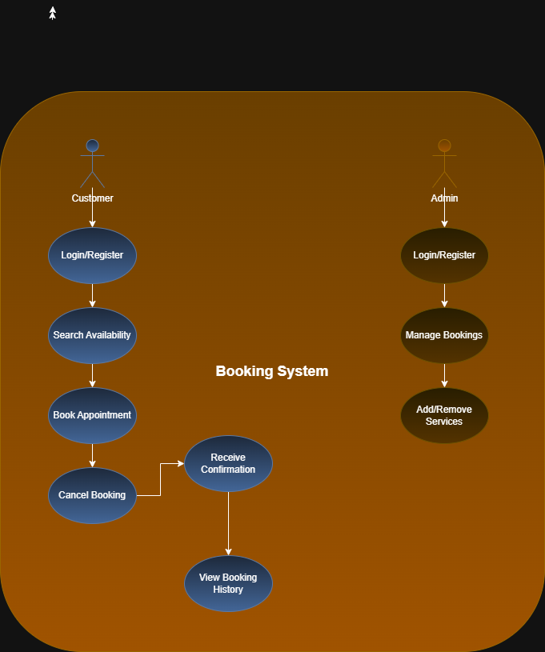

# 📋 Requirement Analysis in Software Development

Welcome to the Requirement Analysis section of our software development project. This document outlines the process, significance, and outputs of requirement analysis – a foundational phase in the Software Development Life Cycle (SDLC).

---

## ❓ What is Requirement Analysis?

Requirement Analysis is a vital phase in the Software Development Life Cycle (SDLC) where stakeholders’ needs are gathered, analyzed, and clearly defined to guide the design and development of a software system. It helps ensure that everyone involved understands what the system should do (functional requirements) and how it should perform (non-functional requirements). This process is essential for setting clear project goals, preventing scope creep, enabling accurate planning, and ensuring the final product meets user expectations and delivers value.

---

## 🎯 Why is Requirement Analysis Important?

* ✅ **Clear Expectations**: Clarifies stakeholder needs, reducing misunderstandings.  
* 📏 **Defined Scope**: Prevents unnecessary additions (scope creep) by outlining project boundaries.  
* 🏗️ **Foundation for Design**: Acts as the blueprint for system architecture and development.  
* ⏱️ **Accurate Planning**: Helps estimate timeframes, costs, and resources.  
* 🔍 **Quality Assurance**: Ensures the final product aligns with expectations and delivers satisfaction.

---

## 🔑 Key Activities in Requirement Analysis

### 1️⃣ Requirement Gathering

Techniques to understand what users and stakeholders want:

* 🗣️ **Interviews**: One-on-one discussions to gather in-depth insights.
* 📝 **Surveys/Forms**: Reach a wider audience for structured feedback.
* 👥 **Workshops**: Collaborative sessions for requirement discovery.
* 👀 **Observations**: Monitor users to detect practical needs.
* 📂 **Document Review**: Analyze existing systems or records for background data.

### 2️⃣ Requirement Elicitation 

Refining initial input into actionable requirements:

* 💡 **Brainstorming**: Generate ideas collaboratively.
* 🧠 **Focus Groups**: Detailed group discussions with representative users.
* 🧩 **Prototyping**: Create visuals or interactive models to gather feedback.

### 3️⃣ Requirement Documentation 

Convert findings into structured, traceable documents:

* 📄 **Requirement Specification**: Detailed description of all system needs.
* 🧾 **User Stories**: Simple narratives describing user interactions.
* 🎬 **Use Cases**: Graphical representations of system behavior.

### 4️⃣ Requirement Analysis & Modeling 

Interpret and prioritize the documented requirements:

* 🎯 **Prioritization**: Rank features by urgency and value.
* ⚙️ **Feasibility Checks**: Assess what's technically and financially doable.
* 📊 **Modeling**: Use diagrams (e.g., ER diagrams, DFDs) for deeper understanding.

### 5️⃣ Requirement Validation 

Ensure all documented needs are correct, complete, and agreed upon:

* 🧾 **Stakeholder Reviews**: Gain formal approval of requirements.
* 📌 **Acceptance Criteria**: Define what "done" means for each feature.
* 🧷 **Traceability Matrix**: Map requirements to design, development, and test cases.

---

## 📑 Types of Requirements

### ⚙️ Functional Requirements

Describe what the system should **do**.

* **Examples**:

  * 🧍‍♂️ User registration & authentication  
  * 🏡 Property search  
  * 📅 Viewing and booking listings  

### 🛡️ Non-Functional Requirements 

Describe how the system should **perform**.

* **Examples**:

  * ⚡ **Performance**: Load times < 2 seconds; support 1000+ users  
  * 🔐 **Security**: Encrypted login, secure data storage  
  * 📈 **Scalability**: Adapt to increasing users/requests  
  * 🎨 **Usability**: Easy-to-navigate UI/UX  
  * 🕒 **Reliability**: 99.9% uptime, quick recovery from failure  

---

## 📚 Use Case Diagrams

Use Case Diagrams are visual tools used in software development to depict how users (actors) interact with a system to achieve specific tasks (use cases). They help represent the system’s functional requirements by illustrating the various actions users can perform and how the system responds. These diagrams provide a clear and concise way to understand user interactions, making it easier for developers, designers, and stakeholders to communicate and align on system functionality. By focusing on user goals, use case diagrams support better planning, clarify system boundaries, and ensure the development stays user-centered.

### ✨ Benefits:

* 👁️ Easy understanding of system flow  
* 🗂️ Organizes and communicates functionalities clearly  
* 🤝 Enhances stakeholder collaboration  

Below is the Use Case Diagram for the Booking System:  

---

## ✅ Acceptance Criteria

### 🧩 Importance in Requirement Analysis

Acceptance Criteria are clearly defined, testable conditions that a feature must fulfill to be considered complete and acceptable by stakeholders. They play a crucial role in Requirement Analysis by translating business needs into specific expectations. This helps eliminate ambiguity, ensures mutual understanding between stakeholders and developers, and forms the basis for user acceptance testing. Well-defined acceptance criteria contribute to higher product quality, reduce misunderstandings, and streamline the validation process.

### 🛒 Example: Checkout Feature in a Booking Management System

**Feature:** Checkout Process

**Acceptance Criteria:**
- ✅ The user can view a summary of selected bookings, including property details, dates, and total cost.  
- 🧾 The system prompts the user to provide or confirm personal and payment information.  
- 📧 Upon successful transaction, the system displays a confirmation message and sends a confirmation email within 2 minutes.  
- ⚠️ All required fields (e.g., name, card number, expiry date, CVV) must be validated before proceeding.  
- 🔁 If the payment fails, the system must display an error message and allow the user to retry or choose a different payment method.  

These criteria help ensure the checkout process is functional, user-friendly, and meets both performance and reliability standards.
